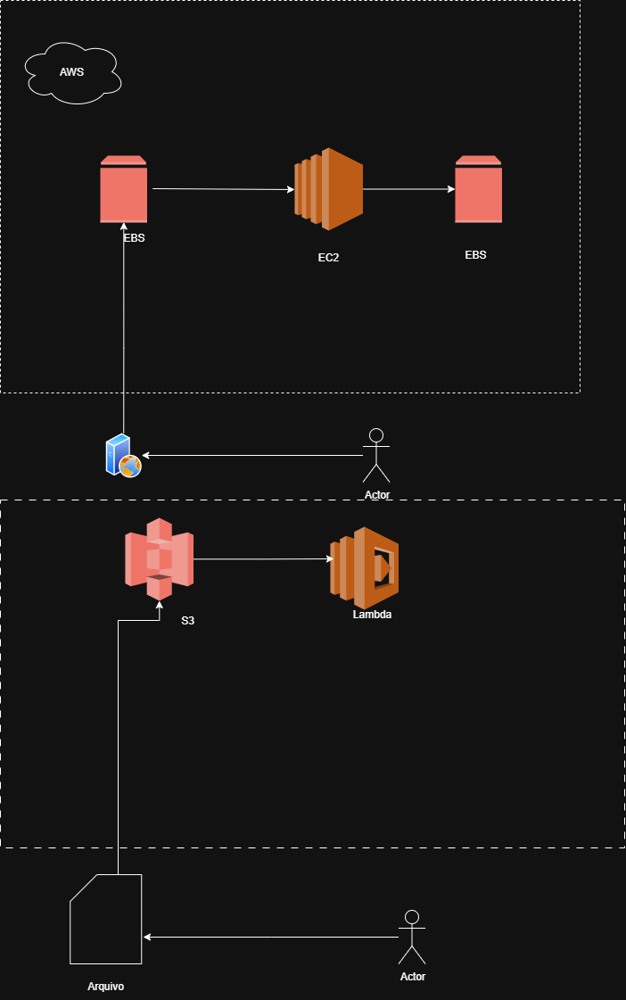

# Projeto 1 - Arquitetura AWS com Draw.io

📌 **Descrição**  
Este projeto consiste na criação de um **diagrama de arquitetura na AWS**, utilizando o [Draw.io](https://www.drawio.com/).  
O objetivo é representar uma solução simples com os principais serviços da AWS.

---

## 🔧 Serviços utilizados

- **Amazon S3** → Armazenamento de objetos (arquivos, imagens e dados).  
- **Amazon EC2** → Instâncias de servidores virtuais para rodar a aplicação.  
- **AWS Lambda** → Funções serverless para execução de código sob demanda.  
- **Amazon EBS** → Volumes de armazenamento para instâncias EC2.  

---

## 🖼️ Diagrama
O diagrama foi criado no **Draw.io** e exportado como imagem PNG:

---

## 🚀 Como reproduzir

1. Acesse o [Draw.io](https://www.drawio.com/).  
2. Recrie a arquitetura utilizando os ícones da AWS.  
3. Exporte o arquivo em \.png\ ou \.drawio\.  
4. Suba o arquivo no repositório GitHub.  

---

## 📚 Referências
- [Documentação AWS S3](https://docs.aws.amazon.com/s3/)  
- [Documentação AWS EC2](https://docs.aws.amazon.com/ec2/)  
- [Documentação AWS Lambda](https://docs.aws.amazon.com/lambda/)  
- [Documentação AWS EBS](https://docs.aws.amazon.com/ebs/)  

